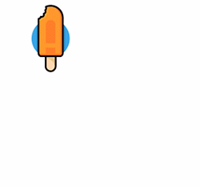

## AnimationSugar

AnimationSugar is a tiny Swift library that can make iOS animation code slightly less ugly.

When iterating on animations, it can be a pain to swap between the many method signatures of `UIView.animateWithDuration`. Also, multi-step animations that nest inside of completion blocks can quickly become an unreadabe mess. 

It was built at [Intrepid](http://intrepid.io).

##Examples

    animate(duration: 0.3) {
        view.transform.tx += 150
    }

    animate(duration: 0.3) {
        view.transform.tx += 150
    }
    .withSpring(dampingRatio: 0.5, initialVelocity: 0)

    animate(duration: 0.3) {
        view.transform.tx += 150
    }
    .thenAnimate(duration: 0.3) {
        view.transform.ty += 150
    }
    .thenAnimate(duration: 0.3) {
        view.transform.tx -= 150
    }
    .thenAnimate(duration: 0.3) {
        view.transform.ty -= 150
    }

    animate(duration: 0.3) {
        view.transform.tx += 150
    }
    .withOption(.CurveEaseOut)
    .withCompletion {
        _ in
        view.backgroundColor = UIColor.redColor()
    }

## Usage

### Cocoapods

    pod install 'AnimationSugar'

## Methods

- `func animate(duration duration: NSTimeInterval, animations: () -> ()) -> Animation`
> Starts an animation. Use trailing closure syntax to write your animations, e.g.: `animate(0.3) { ... }`. This is a global method (prevents compiler warnings of unused initializer).

 
- `func withDelay(delay: NSTimeInterval) -> Animation`
> Set a delay to wait before the animation starts

 
- `func withOption(option: UIViewAnimationOptions) -> Animation`
> Set an animation option for the animation. For multiple options, either chain them e.g. `.withOption(.Autoreverse).withOption(.Repeat)` or use once with an array e.g. `.withOption([.Autoreverse, .Repeat])`.

 
- `func withSpring(dampingRatio dampingRatio: CGFloat, initialVelocity: CGFloat) -> Animation`
> Use a spring animation curve with the given damping ratio and initial velocity.

 
- `func withCompletion(completion: (Bool) -> ()) -> Animation`
> Set a completion block for when the animation finishes. Use trailing closure syntax e.g. `animate(0.3) { ... }.withCompletion { ... }`

 
- `func thenAnimate(duration duration: NSTimeInterval, animations: () -> ()) -> Animation`
> Chain a new animation to occur after the previous animation is completed. See the "square" example above.
